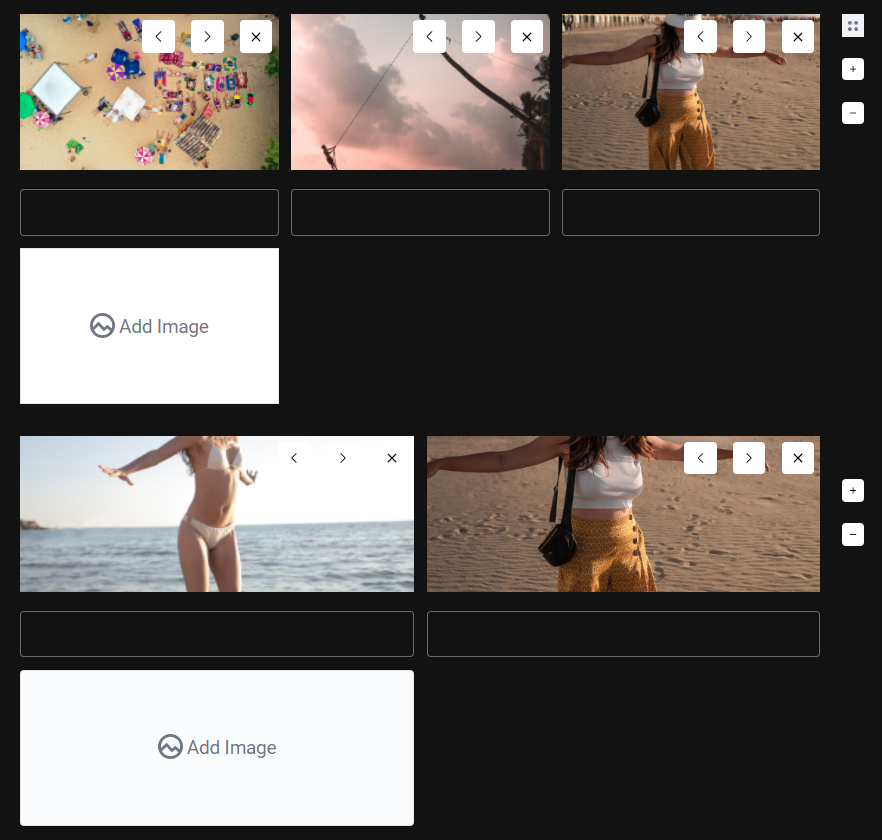

 


# Carousel Tool

Gallery with custom column for [Editor.js](https://editorjs.io).
Forked and modified from [mr8bit/carousel-editorjs](https://github.com/mr8bit/carousel-editorjs)



## Features

- Uploading file from the device
- Preload image
- Change the image position
- Toggle the gallery style ([standard, carousel, masonry] are included)
- Column settings

## Installation

`npm i @vtchinh/gallery-editorjs`

### Manual downloading and connecting

1. Upload folder `dist` from repository
2. Add `dist/bundle.js` file to your page.

## Usage

Add a new Tool to the `tools` property of the Editor.js initial config.

```javascript
import Carousel from 'Carousel';

// or if you inject ImageTool via standalone script
const Carousel = window.Carousel;
 
var editor = EditorJS({
  ...

  tools: {
    ...
    carousel: {
        class: Carousel,
        config: {
            endpoints: {
                byFile: "URL_FETCH",
            }
        }
    },
  }

  ...
});
```
